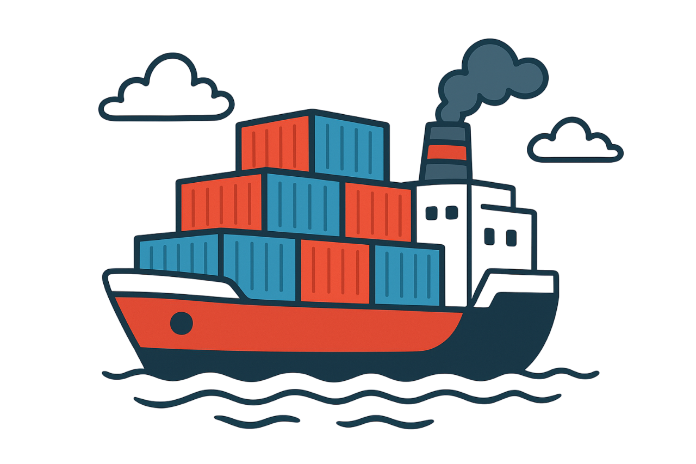

# DugonSNAP

{align=center}

Welcome to the DugonSNAP introduction to get started.

## Introduction

## What is the SNAP suffix?
SNAP, short for "Smart Network Action Protocol", is a concept that proposes an action-based smart grid. This network is highly reactive and designed to respond autonomously at the edge to predefined behaviors or dynamic changes within the network.
***

## How DugonSNAP works in a nutshell?
DugonSNAP is an intelligent communication system composed of client and reactive server, with multiple actions/events, over a protocol called “TCP”, using MongoDB for persistence.

DugonSNAP exposes something called "events/actions", which are basically similar to endpoints with predefined behaviors, but in addition to that, clients on your DugonSNAP network can create dynamic events with unique behaviors.

**Server**: The DugonSNAP server is responsible for redirecting packets to clients on the network, and also reacts to predefined network actions.

**Client**: Clients on the DugonSNAP network have a list of predefined events, as well as the dynamic event system, to add more events with unique actions to those already available for them.

***

# Methaphor and concept

DugonSNAP is based on a naval metaphor.

{ width="200" align=left}
**Ship(Server)**: is responsible for moving any packets on the network to clients.

 

{ width="200" align=left}
- **Dock(Client)**: It is where containers and packages are packed for the ship to take.

 

{ width="200" align=left}
- **Containers**

**Containers**: A container is a living behavior carrier, in which all the behaviors that you want to execute on the target are packaged.

**Containers use the JSON format**, which can be cumbersome and resource-intensive, but helps users understand and prototype quickly and easily.

**Containers are carriers of events and actions, not useful information.**

---

## Streaming system and binary packages 

Both the streaming system and the binary packages are useful in DugonSNAP, since they work together.

{ width="200" align=left}
- **Streaming System**: The streaming system was created to send information with zero overhead in general, reducing resource consumption and maximizing flexibility for the client, offering "tags" to execute special events of the tag, as well as including a dynamic event system. These events can be created remotely from other clients on the network, including unique behaviors in such streaming.

- **Binary Packages**: Binary packets carry a set of bytes, with no special predefined format, just pure bytes, such packets are queued in the client streamings.

***

# Binary Header

The binary header is **present in any packet on the network**, whether it is a Container or a Binary Packet, the job of this binary header is to route and parse the packet.

The binary header works with pure bytes, using its own format.

***

## Origin of the name

"Dugon" takes its name from the marine mammal "Dugong", chosen to represent the balance between strength, stability and intelligent system design.

***